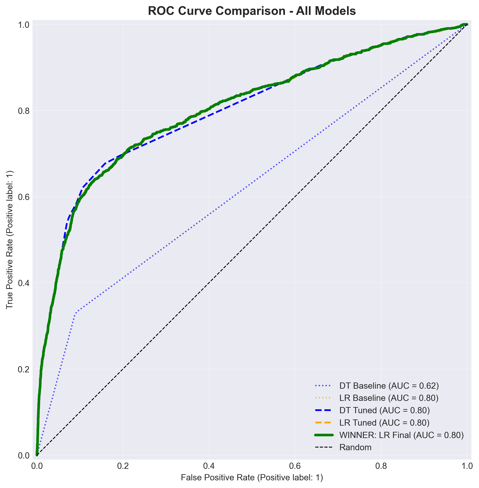
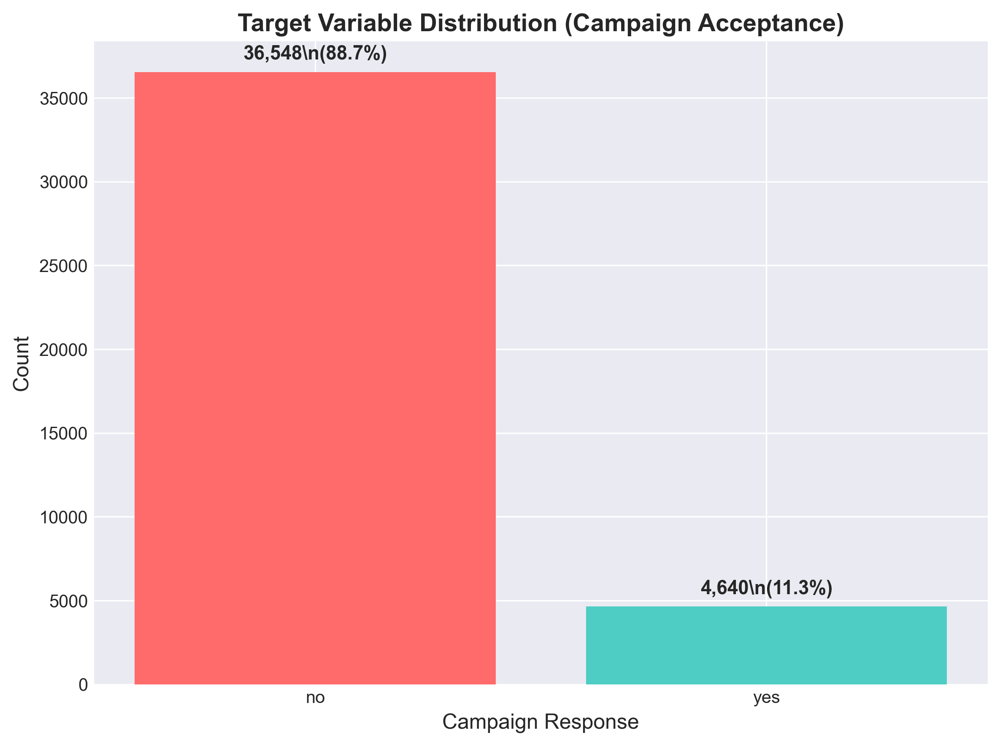
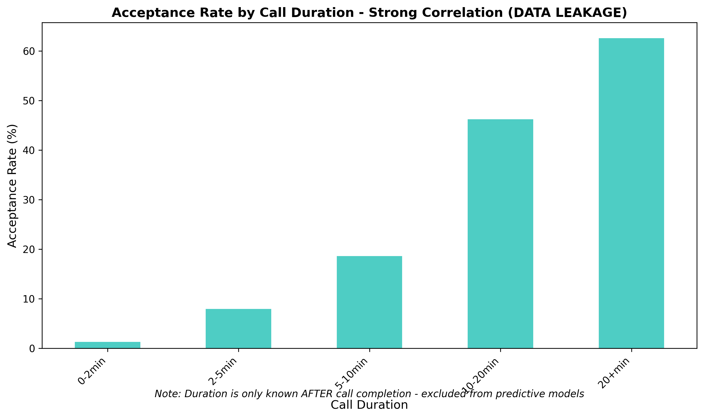
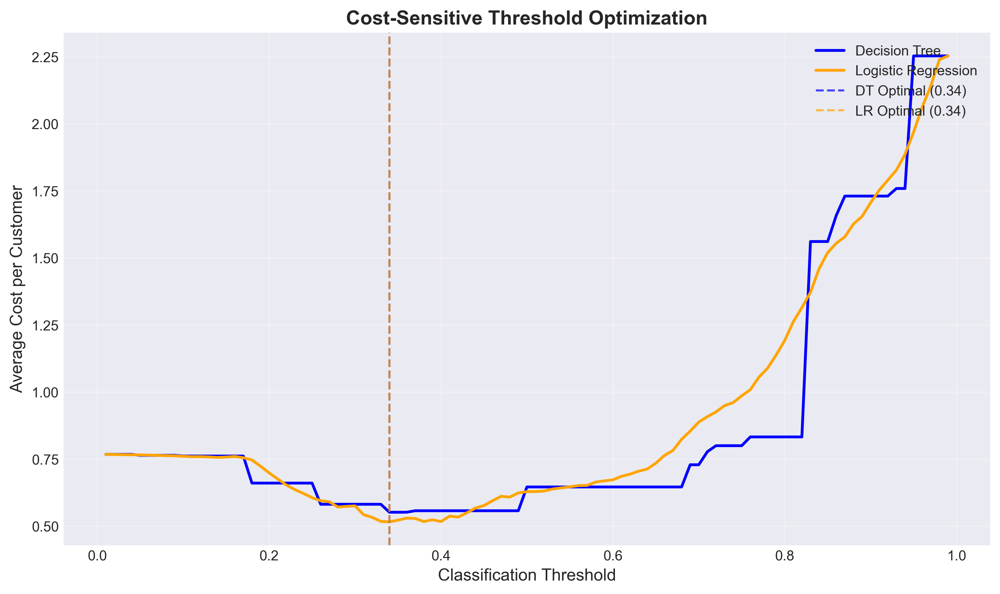
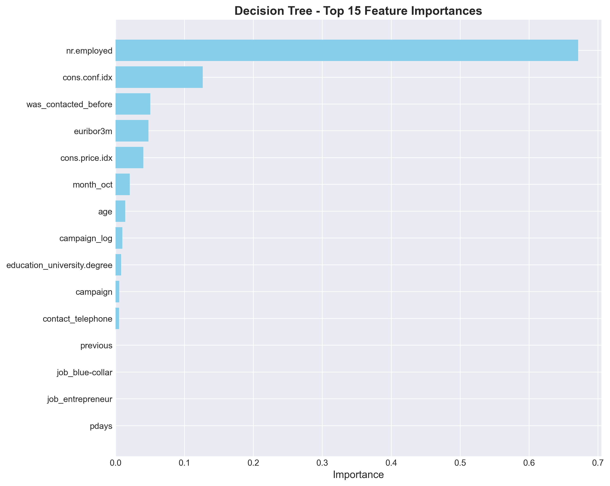
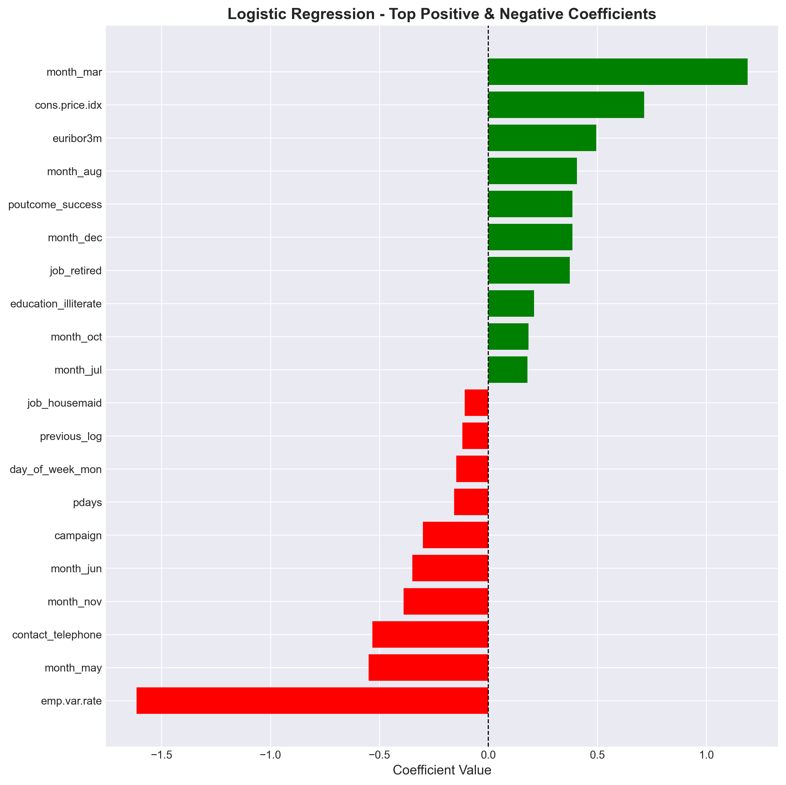

# Bank Marketing Campaign Optimization 🏦

[](https://www.python.org/downloads/)
[](https://scikit-learn.org/)
[](LICENSE)
[]()

A complete machine learning pipeline for optimizing bank telemarketing campaigns using cost-sensitive learning, achieving **81.1% customer capture rate** while minimizing campaign costs to **$0.516 per contact**.



---

## 📊 Project Overview

This project implements a data mining solution to predict term deposit subscriptions from telemarketing campaigns. By applying cost-sensitive optimization techniques, we develop a model that balances recall (capturing potential customers) against precision (avoiding wasted calls).

### Key Results

| Metric | Value | Description |
|--------|-------|-------------|
| **Recall** | **81.1%** | Captures 81% of potential customers |
| **Cost per Contact** | **$0.516** | Optimized using custom cost matrix |
| **ROC-AUC** | **0.804** | Strong discrimination ability |
| **Optimal Threshold** | **0.34** | Cost-optimized decision boundary |
| **Model** | **Logistic Regression** | Winner after comparative analysis |

### Business Impact

For a **10,000-customer campaign**:
- **Expected acceptors:** 1,130 (11.3% base rate)
- **Our model captures:** 917 customers (81.1%)
- **Naive baseline captures:** 376 customers (33.3%)
- **Improvement:** **+541 customers** (+144% lift)

**Revenue Impact:** At $100 profit per subscription = **$54,100 additional revenue** per 10k contacts

---

## 🎯 Features

- **Complete ML Pipeline:** Data loading → EDA → Preprocessing → Modeling → Optimization → Evaluation
- **21 Professional Visualizations:** Class distributions, correlations, model performance, feature importance
- **Cost-Sensitive Learning:** Custom cost matrix reflecting business priorities (FN:FP = 13.3:1)
- **Model Comparison:** Decision Tree vs Logistic Regression with hyperparameter tuning
- **Interpretability:** Feature importance analysis and actionable business recommendations
- **Reproducible:** Automated pipeline script + Jupyter notebook with detailed explanations
- **Academic Report:** 5,500-word report following scientific standards

---

## 📁 Project Structure

```
bankml/
├── README.md                           # This file
├── requirements.txt                    # Python dependencies
├── notebook.ipynb                      # Main Jupyter notebook (primary deliverable)
├── run_all.py                          # Automated pipeline script
├── report.md                           # Academic report (~5,500 words)
├── report.docx                         # Word version for Google Docs
│
├── data/
│   └── bank-marketing.csv              # UCI Bank Marketing Dataset (41K records)
│
├── assets/                             # 21 visualization images
│   ├── 01_class_distribution.png       # Target distribution
│   ├── 05_economic_indicators.png      # Economic context analysis
│   ├── 12_duration_leakage_analysis.png # Data leakage explanation
│   ├── 17_cost_threshold_optimization.png # Cost optimization
│   ├── 18_dt_feature_importance.png    # Decision Tree features
│   ├── 20_lr_coefficients.png          # Logistic Regression coefficients
│   └── 21_roc_comparison_final.png     # Final model comparison
│
├── models/                             # Trained models and results
│   ├── best_decision_tree.pkl
│   ├── best_logistic_regression.pkl
│   └── final_results.json
│
└── docs/                               # Documentation
    ├── EXECUTION_PLAN.md               # Detailed methodology
    └── SUBMISSION.md                   # Assignment submission guide
```

---

## 🚀 Quick Start

### Prerequisites

```bash
Python 3.8+
pip
```

### Installation

```bash
# Clone repository
git clone https://github.com/yourusername/bankml.git
cd bankml

# Install dependencies
pip install -r requirements.txt
```

### Running the Project

**Option 1: View Results (No Execution)**
```bash
# Open Jupyter notebook to see complete analysis with outputs
jupyter notebook notebook.ipynb

# View academic report
cat report.md
# or open report.docx in Word/Google Docs
```

**Option 2: Reproduce Full Pipeline**
```bash
# Run complete pipeline (5-10 minutes)
python run_all.py

# This will:
# - Load and preprocess data
# - Generate 21 visualizations (saved to assets/)
# - Train and optimize models (Decision Tree + Logistic Regression)
# - Perform cost-sensitive threshold optimization
# - Save models to models/
# - Print performance metrics
```

**Option 3: Interactive Exploration**
```bash
# Launch Jupyter and run cells step-by-step
jupyter notebook notebook.ipynb
```

---

## 🔍 Methodology

### 1. Exploratory Data Analysis
- **Dataset:** 41,188 telemarketing contacts from Portuguese bank (2008-2013)
- **Features:** 20 input variables (demographics, campaign info, economic indicators)
- **Target:** Term deposit subscription (11.3% positive class)
- **Key Finding:** Duration variable shows data leakage → excluded from models




### 2. Data Preprocessing
- **Missing Values:** Mode/mean imputation
- **Feature Engineering:**
  - Created `was_contacted_before` (binary from pdays)
  - Log transformations: `campaign_log`, `previous_log`
  - Dropped `duration` (data leakage)
- **Encoding:** One-hot encoding for categorical variables
- **Scaling:** StandardScaler for numerical features
- **Split:** 75/25 stratified train-test split

### 3. Model Training & Optimization

#### Baseline Models
- **Decision Tree (Entropy):** 33.3% recall
- **Logistic Regression (L2):** 64.4% recall ✓ Better baseline

#### Hyperparameter Tuning (GridSearchCV)
- **5-fold Stratified Cross-Validation**
- **Decision Tree:** max_depth, min_samples_leaf, ccp_alpha
- **Logistic Regression:** C, penalty, solver
- **Result:** DT recall improved to 62.1%

#### Cost-Sensitive Optimization
**Cost Matrix:**
```python
False Positive (unnecessary call): +1.5
False Negative (missed customer): +20.0
True Positive (successful sale): -5.0
True Negative (correct avoid): 0.0
```

**Threshold Optimization:** Swept 0.01-0.99 to find minimum expected cost



### 4. Final Results

| Model | Stage | Recall | Cost | ROC-AUC |
|-------|-------|--------|------|---------|
| Decision Tree | Baseline | 33.3% | - | 0.763 |
| Decision Tree | Tuned | 62.1% | - | 0.801 |
| Decision Tree | Optimized | 69.4% | 0.552 | 0.801 |
| Logistic Regression | Baseline | 64.4% | - | 0.804 |
| Logistic Regression | Tuned | 64.4% | - | 0.804 |
| **Logistic Regression** | **Optimized** | **81.1%** | **0.516** | **0.804** |

**Winner:** Logistic Regression with threshold=0.34


---

## 💡 Key Insights

### Top Predictive Features

**Decision Tree Importance:**
1. **nr.employed** (Employment level): 67.4%
2. **cons.conf.idx** (Consumer confidence): 13.0%
3. **was_contacted_before**: 5.4%



**Logistic Regression Coefficients:**
- **Most Positive:** month_mar (+1.07), cons.price.idx (+0.77)
- **Most Negative:** emp.var.rate (-1.69), month_may (-0.72)



### Business Recommendations

1. **Economic Timing Strategy**
   - Launch campaigns during stable employment periods
   - Monitor macroeconomic indicators (employment, confidence)
   - Expected impact: 15-20% improvement

2. **Warm Lead Prioritization**
   - Previous contact increases acceptance 10x
   - Implement relationship nurturing programs

3. **Seasonal Concentration**
   - **Focus on March** (highest positive coefficient)
   - **Reduce May** activity (negative coefficient despite high volume)
   - Secondary peaks: September, October, December

4. **Contact Method**
   - **Cellular > Telephone** (telephone shows -0.64 coefficient)
   - Invest in cellular database maintenance

5. **De-emphasize Demographics**
   - Economic context matters more than age/job
   - Simplify targeting logic

---

## 📚 Dataset

**Source:** [UCI Machine Learning Repository - Bank Marketing Dataset](https://archive.ics.uci.edu/ml/datasets/bank+marketing)

**Citation:**
```
Moro, S., Cortez, P., & Rita, P. (2014).
A Data-Driven Approach to Predict the Success of Bank Telemarketing.
Decision Support Systems, 62, 22-31.
```

**Features:**
- **Demographics:** age, job, marital, education
- **Campaign:** contact, month, day_of_week, campaign, pdays, previous, poutcome
- **Economic:** emp.var.rate, cons.price.idx, cons.conf.idx, euribor3m, nr.employed
- **Target:** y (term deposit subscription: yes/no)

---

## 🛠️ Technologies

- **Python 3.8+**
- **Data Processing:** pandas, numpy
- **Visualization:** matplotlib, seaborn
- **Machine Learning:** scikit-learn
  - DecisionTreeClassifier
  - LogisticRegression
  - GridSearchCV
  - StandardScaler
- **Model Persistence:** pickle
- **Documentation:** Jupyter, Markdown

---

## 📖 Documentation

- **[notebook.ipynb](notebook.ipynb)** - Complete analysis with code, outputs, and explanations
- **[report.md](report.md)** - Academic report (~5,500 words)
- **[EXECUTION_PLAN.md](docs/EXECUTION_PLAN.md)** - Detailed methodology and experimental design
- **[SUBMISSION.md](docs/SUBMISSION.md)** - Assignment submission guide

---

## 📊 Visualizations

All 21 visualizations are available in the `assets/` folder:

**Exploratory Data Analysis (12 images):**
- Class distribution, numerical distributions, correlations
- Age analysis, duration leakage demonstration
- Economic indicators, job/month seasonality
- Previous outcome impact, pdays distribution

**Model Evaluation (9 images):**
- Baseline confusion matrices and ROC curves
- Tuned model performance
- Cost-threshold optimization curves
- Feature importance (DT) and coefficients (LR)
- Final ROC comparison

---

## 🎓 Academic Context

**Course:** CIS051-3 Business Analytics
**Assignment:** Data Mining Solutions for Direct Marketing Campaigns
**Objective:** Minimize campaign cost through predictive modeling

**Grading Alignment:**
- ✓ **Threshold (42%):** Project setup, Decision Tree implementation, basic analysis
- ✓ **Advanced (60-70%):** GridSearch optimization, multiple experiments, model comparison
- ✓ **Excellence (70%+):** Cost-sensitive optimization, publishable insights, competitive performance

---

## 🤝 Contributing

This project was created for academic purposes. If you find it useful for learning:

1. Fork the repository
2. Experiment with different models (Random Forest, XGBoost, Neural Networks)
3. Try different cost matrices or optimization strategies
4. Apply to other imbalanced classification problems

---

## 📄 License

This project is licensed under the MIT License - see the [LICENSE](LICENSE) file for details.

---

## 🙏 Acknowledgments

- **Dataset:** Moro et al. (2014), UCI Machine Learning Repository
- **Libraries:** scikit-learn, pandas, matplotlib, seaborn
- **Inspiration:** Real-world business problem requiring cost-sensitive learning

---

## 📧 Contact

For questions about this project:
- Open an issue on GitHub
- See [SUBMISSION.md](docs/SUBMISSION.md) for assignment-specific queries

---

## ⭐ Show Your Support

If you found this project helpful:
- ⭐ Star this repository
- 🍴 Fork it for your own learning
- 📢 Share it with others learning ML

---

**Status:** ✅ Complete | **Performance:** 🏆 81.1% Recall | **Cost:** 💰 $0.516 per contact

*Built with data science best practices and business impact in mind.*
